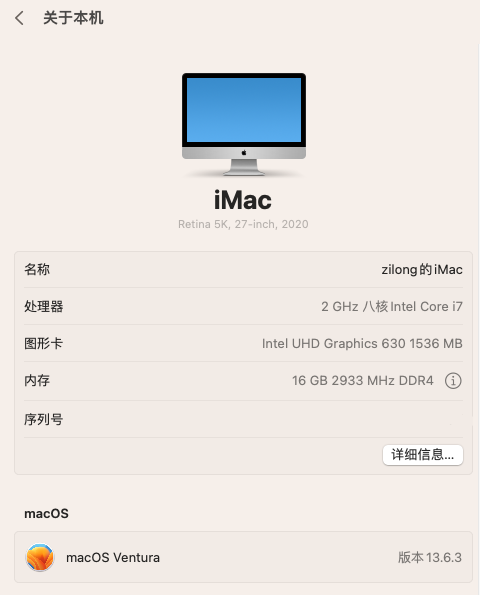

# OpenCore on Dell OptiPlex 7080 MFF

> 1、OpenCore版本： 0.97
>
> 2、MacOS： 黑苹果镜像macOS Ventura 13.6.3(22G436)正式版带 OpenCore 0.9.7 和 Clover r5156 以及 FirPE 引导
>
> 3、使用本分支里的EFI首先 要生成自己的五码，我已经EFI里的改了，为了不和我现在使用的序列号冲突，冲突的话会导致封号
>
> 4、目前仿冒的mac机型我选择是: iMac20,1   【本地调整了机型，在这个机型cpu的频率调度看起来比较好一下】
>
> 5、bios主板版本1.21.1 版本，工作40——60摄氏度之间的转速自动维持在1800～2800左右了，一天几乎都很安静了，持续观察中。。。

## 硬件配置详情

-   Dell OptiPlex 7080 MFF 【低压版本，130W电源】
-   CPU: Intel Comet Lake i7-10700T 【低压】
-   主板型号: Intel Q470
-   内存条: 16G DDR4 3200 \* 2
-   iGPU: UHD 630
-   硬盘1:瑄固态M.2 2280 1T(MacOS)
-   硬盘2:铭瑄固态SATA- 1T（数据盘）
-   硬盘3:M.2 2280 256G（Windows）
-   声卡: ALC256
-   千兆有线网卡: Intel I219-LM7
-   无线网卡  BCM94360CS2+反向转接卡
### @界面效果

1、关于黑苹果的信息

### @ 常工作的硬件功能 (使用 BCM94360CS2白果卡)

-   HWP
-   睡眠、隔空、随行等正常使用
-   iGPU with HiDPI
-   千兆有线网卡
-   wifi无线网正常使用
-   蓝牙
-   喇叭声音正常
-   DP/DP 声音正常使用（DP显示器不正常，需要调整config.list里的参数）

## BIOS主板设置

| Settings                                        |Value|
|-------------------------------------------------|-----|
| System Configuration → SATA Operation           | AHCI |
| Security → PTT Security/PTT On                  | Disabled |
| Secure Boot → Secure Boot Enable                | Disabled |
| Secure Boot → Secure Boot Mode                  | Audit Mode |
| Intel SGE → SGX                                 | Disabled |
| Power Management → Deep Sleep Control           | Disabled |
| Power Management → USB Wake Support             | Disabled |
| Power Management → Wake on LAN/WLAN             | Lan only |
| Power Management → Block Sleep                  | Disabled |
| POST Behavior → Fastboot                        | Minimal |

## 修改DVMT和CFG LOCK的值 提供参考，
* 无法使用Grub Setup_var 需要用到Ru.efi 将Ru.efi在BIOS中添加进Boot Menus 后启动 进入Ru后按 "Alt" + "=" 并
  查找 **CPUSetup** 和 **SaSetup**
* 解锁"CFG-LOCK" 找到CPUSetup 将横排 "0030" "0E" 位改为 00 按 Ctrl + W 保存
* 修改DVMT 搜索 SaSetup 将横排 "00F0" "05" 位改为 "02" 按 Ctrl + W 保存
